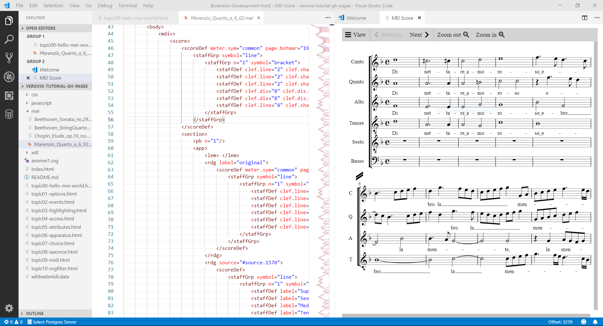

# mei-visualizer README

MEI Score Visualization using Verovio.

## Features

This tool allows to easily visualize the score associated to a MEI file.
It utilize Verovio for the production of the score image.

## Extension Settings

This extension contributes the following settings:

* `meiScore.display`: open the visualization window

